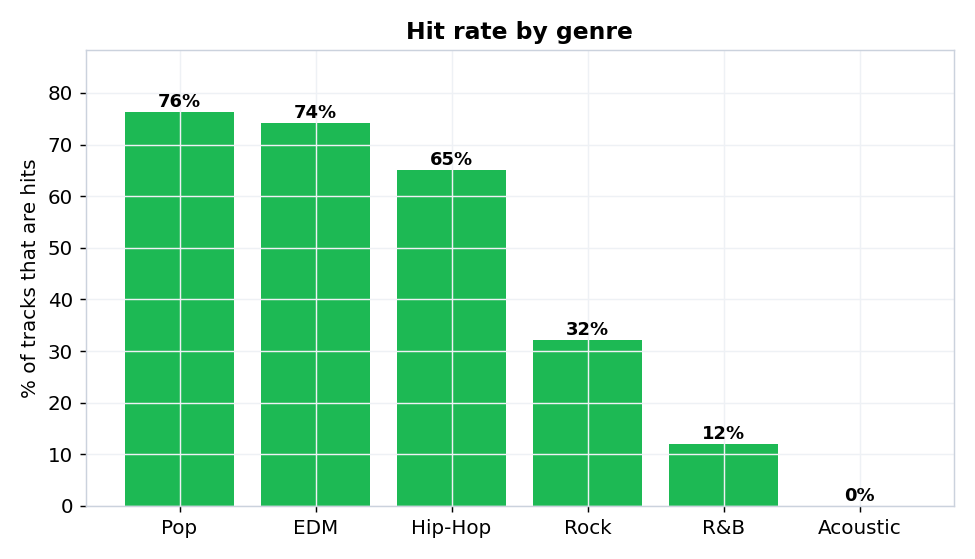
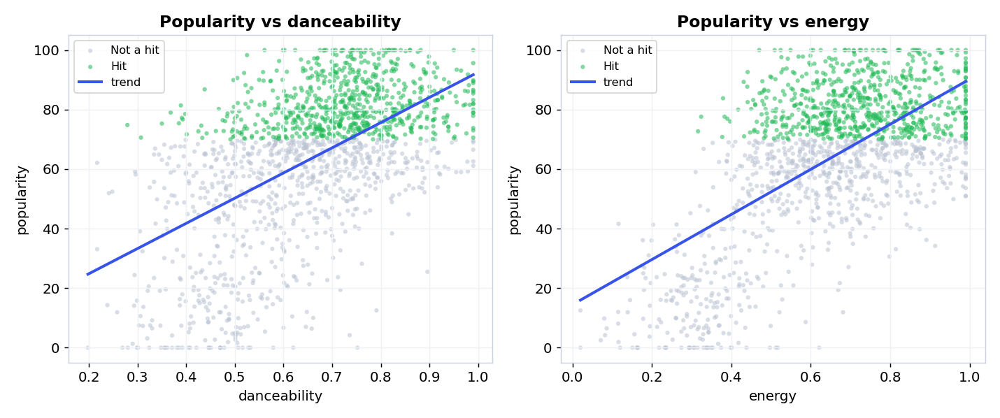
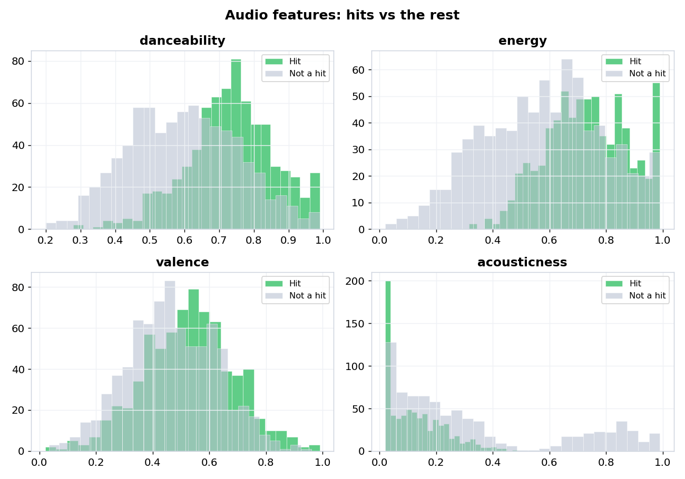
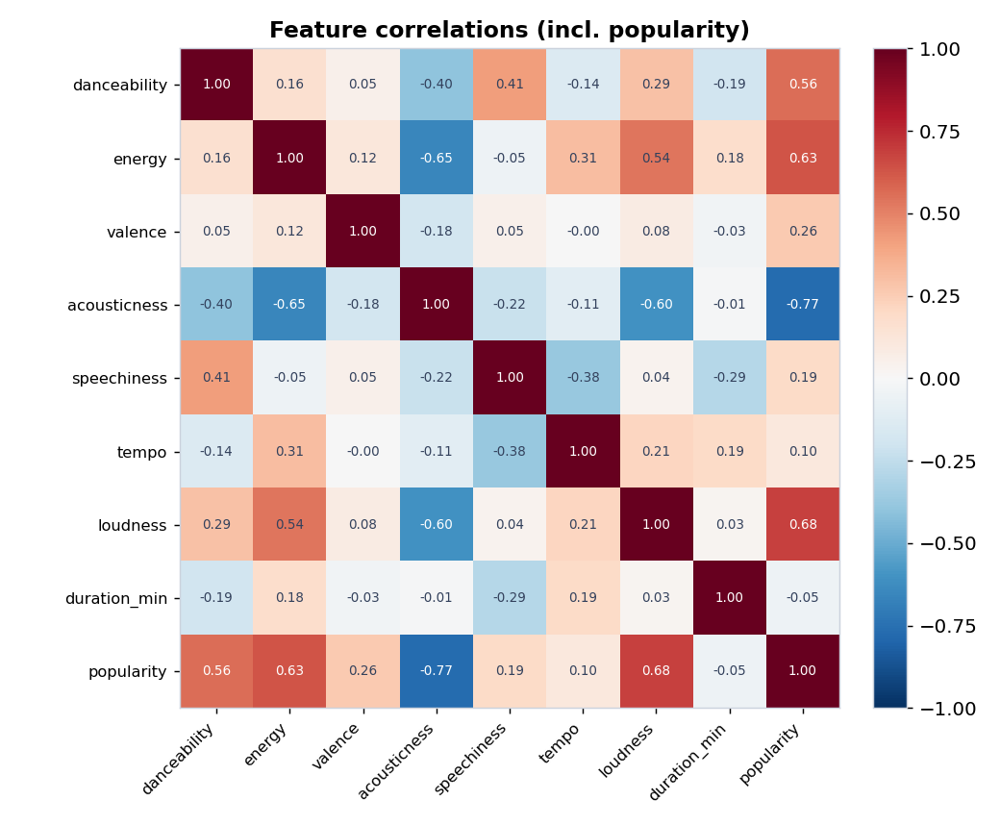
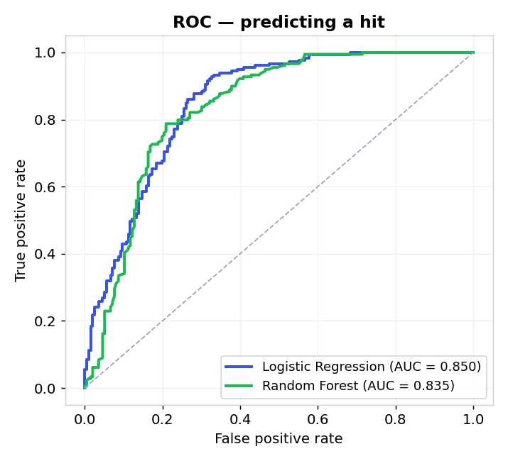
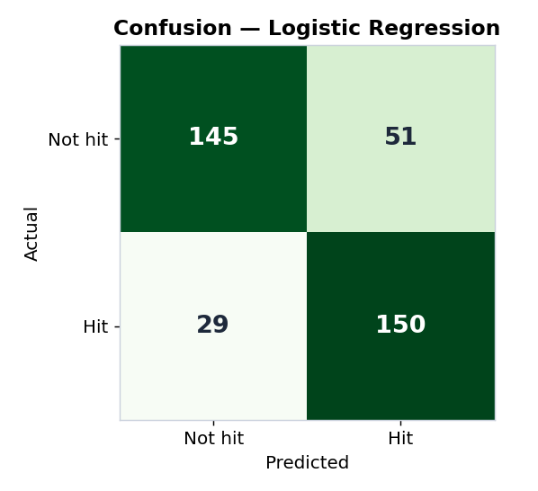
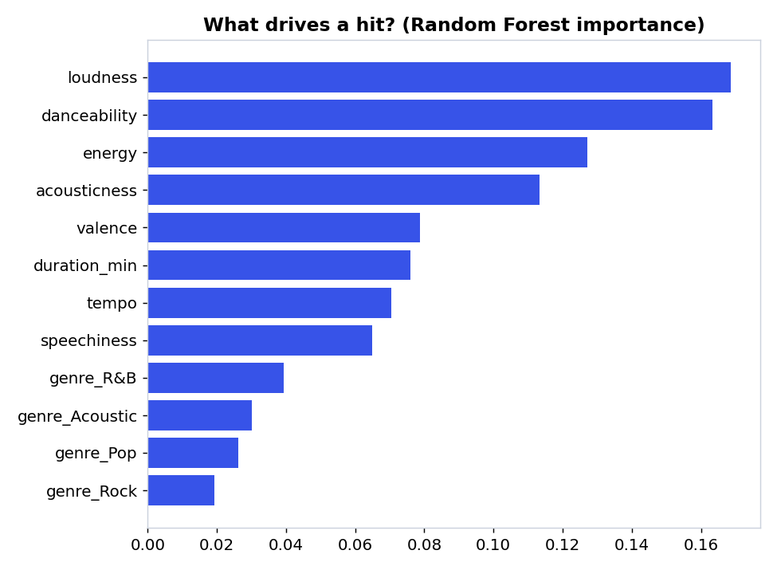

# 🎵 What Makes a Song a Hit?

Exploratory data analysis and a machine-learning model that predicts whether a track is a **hit**, based on its audio features (danceability, energy, valence, loudness, tempo…).


> **About the data:** this project uses a **synthetic dataset of 1,500 tracks** (`songs.csv`, created by `generate_dataset.py`) modelled after Spotify-style audio features. No real songs are used — but the feature relationships are designed to be realistic, so the analysis and modelling are genuine. Swap in a real CSV with the same columns and everything still runs.

---

## 🔍 Key findings

- **Acousticness is the strongest signal** — and it's *negative*: acoustic tracks rarely chart (corr **−0.77** with popularity).
- **Loud, energetic, danceable songs win:** popularity correlates **+0.68** with loudness, **+0.63** with energy, **+0.56** with danceability.
- **Genre matters a lot:** Pop (76%), EDM (74%) and Hip-Hop (65%) are mostly hits; Rock (32%), R&B (12%) and Acoustic (0%) much less.
- A model can predict a hit from audio features alone with **~79% accuracy / 0.85 ROC-AUC**.

|  |  |
|:--:|:--:|
| Hit rate by genre | Popularity vs danceability & energy |

|  |  |
|:--:|:--:|
| Audio features: hits vs the rest | Feature correlations |

## 🤖 Predicting a hit

Two classifiers were trained on a 75/25 stratified split (features = audio features + one-hot genre):

| Model | Accuracy | Precision | Recall | F1 | ROC-AUC |
| --- | :--: | :--: | :--: | :--: | :--: |
| Logistic Regression | 0.787 | 0.746 | 0.838 | 0.789 | **0.850** |
| Random Forest | 0.787 | 0.770 | 0.788 | 0.779 | 0.835 |

*Random Forest 5-fold CV accuracy: **0.781**.*

|  |  |  |
|:--:|:--:|:--:|
| ROC curves | Confusion matrix | What drives a hit |

The most important predictors (Random Forest): **loudness, danceability, energy, acousticness**.

## ▶️ Run it

```bash
pip install -r requirements.txt
python generate_dataset.py   # creates songs.csv
python analysis.py           # writes figures/ and results.csv
```

## 🗂️ Structure

```
generate_dataset.py   # builds the synthetic songs.csv
analysis.py           # EDA + model training + figures
songs.csv             # the dataset (1,500 tracks)
results.csv           # model metrics
figures/              # all generated charts
requirements.txt
```

## 🛠️ Tech

Python · pandas · NumPy · scikit-learn (LogisticRegression, RandomForest) · Matplotlib. Reproducible (`random_state=42`).

## 📄 License

MIT © [evelinvee](https://github.com/evelinvee)
